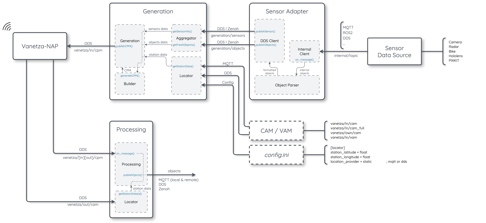

# ITS Perception Service

The ITS Perception Service is a C++ V2X communication module implementing the **Collective Perception Service (CPS)** according to ETSI TS 103 324. It collects object detections from multiple heterogeneous sensors — radars, cameras, and lidar-based platforms — and generates **Collective Perception Messages (CPMs)** that inform nearby vehicles and infrastructure of the detected objects. It also supports the reception and processing of incoming CPMs, extracting and republishing the perceived object information through standard messaging transports for use by external applications

### Citation
If you find this code useful in your research, please consider citing:

```bibtex
@article{FIGUEIREDO2026,
  author  = {Andreia Figueiredo and João Amaral and Pedro Rito and Miguel Luís and Susana Sargento},
  title   = {Improving object selection for Collective Perception Messages under congestion},
  journal = {Ad Hoc Networks},
  year    = {2026},
  doi     = {https://doi.org/10.1016/j.adhoc.2026.104175},
}
```

### Key Features
- ETSI TS 103 324 compliant CPM generation
- Modular sensor adapter architecture — easy to extend with new sensor types
- Flexible station location providers: static (RSU) or dynamic via MQTT/DDS (OBU)
- Multi-transport output: DDS, local MQTT, remote MQTT, Zenoh
- Prometheus metrics for both generation and processing services


## Table of Contents
- [Requirements](#requirements)
- [Quick Start](#quick-start)
- [Architecture](#architecture)
- [Message Formats](#message-formats)
- [Configuration](#configuration)
- [Deployment](#deployment)
- [Monitoring & Metrics](#monitoring--metrics)
- [Development Status](#development-status)
- [Documentation & Examples](#documentation--examples)
- [Authors](#authors)
- [License](#license)

## Requirements

- **MQTT Broker** *(mandatory)*  
  Used by sensor adapters and optionally by the Processing service output.
  ```bash
  sudo apt install mosquitto mosquitto-clients
  sudo systemctl start mosquitto
  ```


- **Docker & Docker Compose** *(mandatory)*  
  Used to run all ITS Perception Service components.
  ```bash
  docker --version
  docker compose version
  ```

- **V2X Stack (Vanetza-NAP)** *(optional)*  
  Required only for transmitting CPMs over a V2X network.  
  The ITS Perception Service can run without it — Generation publishes CPMs on DDS and the Processing service can consume them locally.  

  Vanetza-NAP is available at [GitHub](https://github.com/nap-it/vanetza-nap)


<br>

> For NAP members the Mosquitto broker, the Docker and the Vanetza-NAP deployment should be done using the `playbook_mosquitto.yml`, `playbook_docker.yml`, `playbook_vanetza.yml` available in the `individual-playbook` folder [here](https://code.nap.av.it.pt/mobility-networks/apu-playbooks)

## Quick Start

1. Clone the repository and enter the project folder:
```bash
git clone https://github.com/nap-it/its-perception-service.git
cd its-perception-service
```

2. Start the ITS Perception Service. By default, docker compose starts four containers: Generation, Processing, Camera Adapter, and Radar Adapter:
```bash
docker compose up -d
```

3. Simulate a sensor detection by publishing, for example, an object to the camera adapter:
```bash
mosquitto_pub -h localhost -t "jetson/camera/1/tracking/objects" -m '{
  "objects": [{
    "objectID": 1,
    "sensorID": 3,
    "timestamp": 1746000000.0,
    "latitude": 40.6303,
    "longitude": -8.6542,
    "heading": 90.0,
    "speed": 5.0,
    "confidence": 80,
    "classification": 1
  }]
}'
```

4. Observe the processed output:
```bash
mosquitto_sub -h localhost -t "objects" -v
```

## Architecture

The ITS Perception Service is composed of several Docker containers that work together to generate and process Collective Perception Messages (CPMs).

The main components are:
- **Sensor Adapters**: lightweight bridges that receive data from external sensor sources, convert it to the internal object format, and publish it to the `generation/objects` DDS topic. 
- **Generation**: receives object and sensor information from the Sensor Adapters through DDS or Zenoh. It keeps track of the detected objects, checks which ones are fresh enough to be included according to ETSI priority rules, builds a compliant CPM JSON message, and publishes it through DDS, typically to `vanetza/in/cpm` for V2X transmission.

- **Processing**: receives CPMs from DDS topics, decodes each message, enriches the objects with absolute coordinates and decomposed velocity vectors, and republishes the result in an application-friendly JSON format through MQTT, DDS, and Zenoh.




### Sensor Adapters
Sensor adapters connect the ITS Perception Service to external data sources such as cameras, radars, or autonomous vehicle stacks.
Each adapter receives data from a specific source, converts it to the internal object format, and publishes it to the `generation/objects` DDS topic.  
Multiple adapters can run at the same time, depending on the available sensors.


Some examples of adapters include: 
- **[Camera Adapter](sensor-adapters/camera-adapter/)** — subscribes to MQTT topics containing the output of a camera detection pipeline.
- **[Radar Adapter](sensor-adapters/radar-adapter/)** — subscribes to an MQTT topic containing radar detections.
- **[Bike Adapter](sensor-adapters/bike-adapter/)** — subscribes to an MQTT topic containing detections from a Raspberry Pi camera mounted on a bicycle.
- **[Autoware Adapter](sensor-adapters/autoware-adapter/)** — subscribes to DDS topics produced by the Autoware VPI (more information in [Autoware VPI](https://github.com/nap-it/autoware_vpi)).

#### Implementing a Custom Adapter

To integrate a new sensor type, create an adapter that publishes a JSON message to the DDS topic `generation/objects` (domain ID matching `aggregator.domain_id` in the Generation config) in the format described in the [Object Data](#object-data----input-topic-generationobjects) section.

Optionally, also publish to `generation/sensors` to include a Sensor Information Container in the CPM.


### Generation
The Generation service is responsible for creating CPMs.
It receives object and sensor data from the Sensor Adapters through DDS or Zenoh, checks which objects should be included in the next CPM, builds the CPM JSON message, and publishes it to DDS.

The service is composed of four main classes:
- **Generation** - controls the CPM generation cycle.
- **Aggregator** — subscribes to `generation/objects` and `generation/sensors`, maintains the object cache, and applies ETSI freshness/priority logic.
- **Builder** — builds the CPM JSON message in an ETSI-compliant structure from the selected objects, sensor data, and station position.
- **Locator** — provides the current station position. This can come from a static configuration or from live CAM/VAM messages over MQTT or DDS.

On each generation cycle, by default every 100 ms, the service:

1. Queries the Aggregator for **fresh objects** — objects whose state has changed enough to be included in a new CPM, according to ETSI TS 103 324 priority rules
2. Gets the current station position from the Locator
3. Passes the fresh objects, sensor metadata, and station position to the Builder
4. Publishes the resulting CPM JSON


**ETSI Priority Rules** — an object is considered fresh if any of the following thresholds are exceeded since the object was last included in a CPM:
- Position change ≥ 4 m (P_MIN–P_MAX: 0–8 m)
- Speed change ≥ 0.5 m/s (S_MIN–S_MAX: 0–1 m/s)
- Heading change ≥ 4° (O_MIN–O_MAX: 0–8°)
- Time since last inclusion ≥ 1000 ms (T_MIN–T_MAX: 100–1000 ms)

These thresholds can be disabled by setting `aggregator.ignore_rules = true` in the Generation config. In this case all objects are included in the CPM.

### Processing 
The Processing service receives CPMs from DDS topics and converts them into an easier-to-use object format.

For each received CPM, the Processing service:
1. Extracts sender information from a CAM lookup (speed, heading, altitude, acceleration).
2. Converts ETSI relative object positions back to absolute WGS-84 latitude and longitude coordinates.
3. Converts object speed and heading into north/east velocity components.
4. Converts sensor type and classification codes into readable strings.
5. Publishes the enriched object list through MQTT, DDS, and Zenoh.


## Communication Technologies

The ITS Perception Service supports multiple communication technologies depending on the deployment scenario.  
Due to its microservice-based architecture, communication interfaces are isolated from the core generation and processing logic, making it straightforward to add or replace communication backends.

| Interface | Description | Technologies |
|---|---|---|
| Sensor input | Object detections received from external sensors by the Adapter services | DDS, MQTT, Zenoh, ... |
| Internal communication | Communication between ITS Perception Service containers | DDS |
| CPM dissemination | CPMs forwarded to Vanetza-NAP for V2X transmission | DDS |
| CPM reception | CPMs received from Vanetza-NAP | DDS |
| Processed object output | Enriched object data published for external applications | MQTT, DDS, Zenoh |
| Station location input | CAM/VAM messages used for station positioning | DDS, MQTT |

## Message Formats

### Sensor Data — input topic `generation/sensors`

```json
{
    "sensorID": 1,
    "sensorType": 3,
    "shadowingApplies": false
}
```

| Field | Type | Description |
|---|---|---|
| `sensorID` | integer | Unique sensor identifier |
| `sensorType` | integer | ETSI [SensorType](https://forge.etsi.org/rep/ITS/asn1/cpm_ts103324/-/blob/master/docs/ETSI-ITS-CDD.md#SensorType): 1=Radar, 2=Lidar, 3=Monovideo, 12=LocalAggregation, 13=ITSAggregation |
| `shadowingApplies` | boolean | Whether shadowing applies to this sensor |

### Object Data — input topic `generation/objects`

```json
{
    "objects": [
        {
            "objectID": 1,
            "sensorID": 3,
            "timestamp": 1746000000.0,
            "latitude": 40.6303,
            "longitude": -8.6542,
            "altitude": 10.0,
            "heading": 90.0,
            "speed": 5.0,
            "acceleration": 0.0,
            "confidence": 80,
            "classification": 1,
            "size_x": 0.5,
            "size_y": 1.7,
            "size_z": 1.8,
            "angular_velocity": 0.0,
            "cov_heading": 0.0,
            "cov_speed": 0.0,
            "cov_latitude": 0.0,
            "cov_longitude": 0.0,
            "cov_altitude": 0.0,
            "cov_angular_velocity": 0.0
        }
    ]
}
```

Optional fields may be omitted; the Generation service treats missing values as unavailable.

| Field | Type | Required | Description |
|---|---|---|---|
| `objectID` | integer | yes | Unique object identifier (per sensor) |
| `sensorID` | integer | yes | ID of the sensor that detected this object |
| `timestamp` | double | yes | UNIX timestamp of the detection (seconds) |
| `latitude` | float | yes | Object latitude (degrees) |
| `longitude` | float | yes | Object longitude (degrees) |
| `heading` | float | yes | Object heading (0–360°) |
| `speed` | float | yes | Object speed (m/s) |
| `confidence` | integer | yes | Detection confidence (1–100, or 101 if unavailable) |
| `classification` | integer | yes | [TrafficParticipantType](https://forge.etsi.org/rep/ITS/asn1/cpm_ts103324/-/blob/master/docs/ETSI-ITS-CDD.md#TrafficParticipantType): 0=Unknown, 1=Pedestrian, 2=Bicycle, 3=Moped, 4=Motorcycle, 5=Car, 6=Bus, 7=LightTruck, 8=HeavyTruck, 15=RSU |
| `altitude` | float | no | Object altitude (m) |
| `acceleration` | float | no | Object acceleration (m/s²) |
| `size_x` | float | no | Object width (m) |
| `size_y` | float | no | Object length (m) |
| `size_z` | float | no | Object height (m) |
| `angular_velocity` | float | no | Angular velocity (rad/s) |
| `cov_*` | float | no | Covariance values for the corresponding field |

### Processed Objects — output topic `objects`

Published by the Processing service. See [docs/examples/processed_output.json](docs/examples/processed_output.json) for a full example.

```json
{
    "sender": {
        "id": 1001,
        "type": 15,
        "latitude": 40.6303,
        "longitude": -8.6542,
        "altitude": 10.0,
        "speed": 0.0,
        "acceleration": 0.0,
        "heading": 0.0
    },
    "receiver": {
        "id": 1002,
        "type": 15
    },
    "cpm": {
        "age": 50,
        "timestamp": 1746000000.0,
        "timestamp2004": 694485600.0
    },
    "objects": [
        {
            "id": 1,
            "uniqueID": 10011,
            "age": 50,
            "timestamp": 1746000000.0,
            "classification": "pedestrian",
            "classificationID": 1,
            "confidence": 80,
            "latitude": 40.6305,
            "longitude": -8.6540,
            "xDistance": 25.0,
            "yDistance": 15.0,
            "altitude": 10.0,
            "speed": 5.0,
            "xVelocity": 5.0,
            "yVelocity": 0.0,
            "heading": 90.0,
            "sensorType": "monovideo",
            "sensorID": 3
        }
    ]
}
```

## Configuration

Each container is configured via a `config.ini` file mounted as a Docker volume. Refer to each component's README for the full configuration reference:

- [Generation `config.ini`](generation/README.md)
- [Processing `config.ini`](processing/README.md)
- [Camera Adapter `config.ini`](sensor-adapters/camera-adapter/README.md)
- [Radar Adapter `config.ini`](sensor-adapters/radar-adapter/README.md)
- [Bike Adapter `config.ini`](sensor-adapters/bike-adapter/README.md)
- [Autoware Adapter `config.ini`](sensor-adapters/autoware-adapter/README.md)

## Deployment

### Docker Compose (local / development)

The [`docker-compose.yml`](docker-compose.yml) file includes the Generation, Processing, Camera Adapter, and Radar Adapter services:

```bash
docker compose up -d
```

Additional compose files are available for single-camera and radar-only deployments under the [`agent/`](agent/) folder.

### Ansible (production)

The [`deployment/`](deployment/) folder contains an Ansible role that deploys the ITS Perception Service to one or more target hosts.

```bash
cd deployment
ansible-playbook deploy.yml -i inventory/hosts.yml
```

Edit [`deployment/inventory/hosts.yml`](deployment/inventory/hosts.yml) to set the target host(s) and override any configuration variables. The full list of configurable variables is in [`deployment/roles/cps/defaults/main.yml`](deployment/roles/cps/defaults/main.yml).

Supported deployment scenarios (defined in `hosts.yml`): RSU, PIXKIT, HOLOLENS, BIKE, and others.


## Monitoring & Metrics

When Prometheus metrics are enabled (`prometheus = true` in config), the services expose metrics endpoints:

| Service | Port | Config flag |
|---|---|---|
| Generation | 9102 | `generation.prometheus = true` |
| Processing | 9103 | `processing.prometheus = true` |

**Generation metrics** (`cps_generation_*`):
- `cpm_publish_total` — total CPMs published
- `last_cpm_ts_seconds` — UNIX timestamp of the last CPM
- `cpm_build_ms` — CPM build latency histogram
- `cycle_ms` — generation loop cycle duration histogram
- `objects_per_msg` — objects per CPM histogram
- `radar_messages_total` — total radar object messages received
- `camera_messages_total` — total camera object messages received

**Processing metrics** (`cps_processing_*`):
- `object_age_ms` — received object age histogram
- `cycle_ms` — processing cycle duration histogram
- `pub_messages_total` — total messages published

Performance CSV logs (when `performance_logs = true`) are written to `/logs/` inside the container.

## Development Status

### Implemented
- CPM generation with ETSI TS 103 324 compliant structure
- ETSI priority-based object freshness evaluation
- Movement predictor priority mode (alternative to ETSI rules)
- Management Container and Perceived Object Container
- Sensor Information Container
- Multi-sensor support (radar, camera, lidar/Autoware, bike camera)
- Station location providers: STATIC, MQTT (CAM/VAM), DDS (CAM/VAM)
- Multi-transport output: DDS, local MQTT, remote MQTT, Zenoh
- Prometheus metrics
- Ansible deployment


## Documentation & Examples

This repository includes configuration references, CPM structure documentation, input/output examples, and automatically generated API documentation.

### Configuration Reference

Each component provides its own configuration reference and deployment notes:

- [Generation](generation/README.md)
- [Processing](processing/README.md)
- [Camera Adapter](sensor-adapters/camera-adapter/README.md)
- [Radar Adapter](sensor-adapters/radar-adapter/README.md)
- [Bike Adapter](sensor-adapters/bike-adapter/README.md)
- [Autoware Adapter](sensor-adapters/autoware-adapter/README.md)

### CPM Structure Reference

For a field-by-field description of the CPM JSON structure, see:

- [docs/cpmReference.md](docs/cpmReference.md)

### Input Examples

- [docs/examples/sensor_object_input.json](docs/examples/sensor_object_input.json) — example object detections published to `generation/objects`
- [docs/examples/sensor_info_input.json](docs/examples/sensor_info_input.json) — example sensor metadata published to `generation/sensors`

### Output Examples

- [docs/examples/cpm_output.json](docs/examples/cpm_output.json) — example CPM generated by the Generation service
- [docs/examples/cpm_output_captured.json](docs/examples/cpm_output_captured.json) — real CPM captured from an ITS aggregation source
- [docs/examples/cpm_received_v2x.json](docs/examples/cpm_received_v2x.json) — CPM received through V2X including radio metadata
- [docs/examples/processed_output.json](docs/examples/processed_output.json) — enriched object output produced by the Processing service

### API Documentation (Doxygen)

This project provides automatically generated API documentation using Doxygen.

To generate the documentation locally:

```bash
doxygen Doxyfile
```

## Authors

Development of the ITS Perception Service is part of ongoing research work at [Instituto de Telecomunicações' Network Architectures and Protocols Group](https://www.it.pt/Groups/Index/36).

Questions and bug reports: andreiagf@av.it.pt / jp.amaral@av.it.pt 

## License

The ITS Perception Service is licensed under LGPLv3. See the [LICENSE](LICENSE) file for details.
